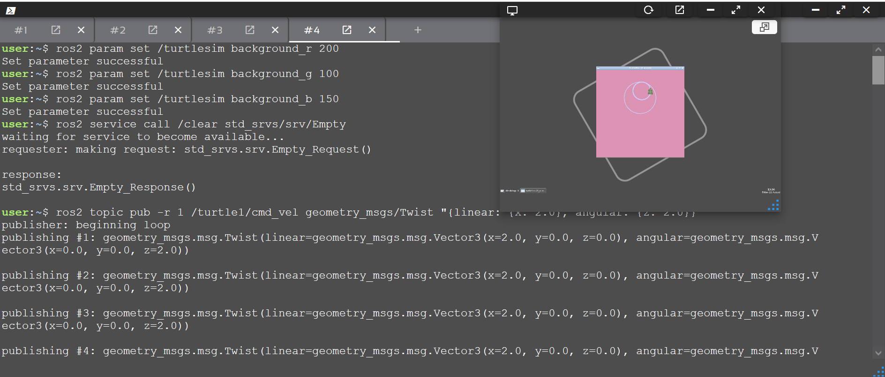

# Turtlesim Project in ROS2

## Project Description

This project demonstrates the basics of ROS2 (Robot Operating System 2) using the Turtlesim simulator.
The main goal is to:

1. Launch a turtle in the simulated environment.

2. Move the turtle programmatically in circular paths.

3. Change the background color dynamically.

4. Clear the turtle’s path and reset the screen.

This project helps beginners understand ROS2 nodes, topics, services, and parameters through hands-on practice with a simple yet visual simulator.

## Development Environment

- Platform: Construct AI online environment.

- Programming Language: Bash commands for ROS2, Python optional for extensions.

- ROS2 Distribution: Humble Hawksbill (pre-installed in Construct AI environment).

Attempted to run ROS2 locally on Ubuntu (e.g., in VirtualBox), but my system was not compatible.

- Simulator: Turtlesim (pre-installed in Construct AI environment).

- IDE / Editor: Online code editor provided by Construct AI.

All commands and nodes are executed directly in the Construct AI terminal, no local installation required.

## Project Sections (run it by copy these 4 sections codes to your construct terminal)

- Section 1: Launch Turtlesim Simulator:
Launch the main simulator window with the default turtle.

the code:
source /opt/ros/humble/setup.bash

ros2 run turtlesim turtlesim_node

- Section 2: Move the Turtle:
Move the turtle using the cmd_vel topic to make it move in a circular path.

the code:
ros2 topic pub -r 10 /turtle1/cmd_vel geometry_msgs/Twist "{linear: {x: 2.0}, angular: {z: 1.0}}" &
sleep 5
kill $!

- Section 3: Change Background Color:
Change the background color to a custom color (e.g., pink) before or after moving the turtle.

the code:
ros2 param set /turtlesim background_r 200

ros2 param set /turtlesim background_g 100

ros2 param set /turtlesim background_b 150

- Section 4: Clear Paths and Keep Turtle Stationary
After moving, use the /clear service to erase all paths and leave the screen empty.

the code:
ros2 service call /clear std_srvs/srv/Empty "{}"

## Key Learning Points

How to launch ROS2 nodes using ros2 run.

How to publish to topics (cmd_vel) to control robot movement.

How to change ROS2 parameters dynamically.

How to call ROS2 services to interact with the system.

Introduction to Turtlesim simulator as a beginner-friendly visualization tool.

How to work in a cloud-based ROS2 environment (Construct AI) without local installation
